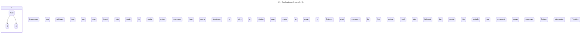
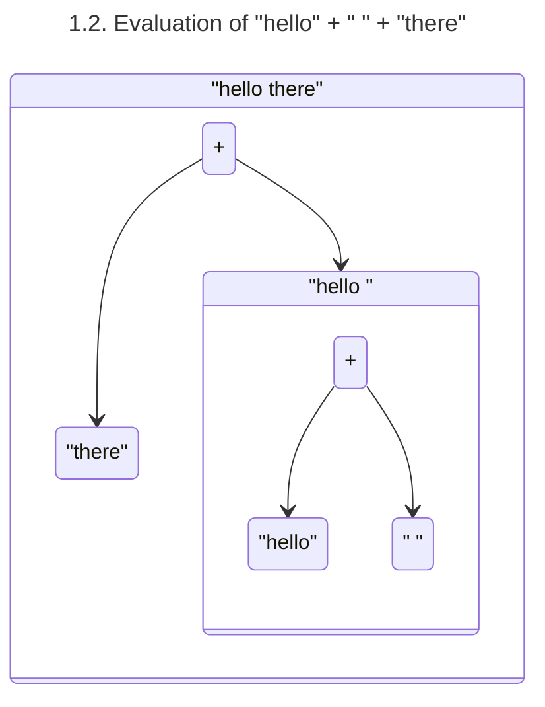

# Expressions

## Primitive Values

Primitive values are the most basic syntactic element (unit of language) in Python. The number of primitive values that are supported in a programming language varies language-to-language, but Python supports five different types of primitive values:

| Type       | Description                                                    | Examples                             |
| ---------- | -------------------------------------------------------------- | ------------------------------------ |
| `number`   | A whole or decimal number.                                     | `3.141`, `-100`, `42`                |
| `bool`     | A boolean (`True` or `False`) value.                           | `True` or `False`                    |
| `string`   | A string of characters surrounded in single or double quotes.  | `"hello world"`, `'abc'`, `""`, `''` |
| `None`     | A special value which is used to represent nothing!            | `None`                               |
| `function` | A function in zero or more arguments, parameters, or "inputs". | `lambda x: x + 1`                    |

## Call Expressions

Call expressions are expressions that _apply_ (or, _call_) a function value to some number of arguments and obtain the value returned by the function, if any. To write a _call expression_ in Python, we write the name of the function followed by parenthesis that enclose all of the functions arguments separated by a comma. For example, to call the function `max` which takes 2 or more values as arguments and compares them we write. 

```python
>>> max(0, 5)
5
```

The largest argument given to the [`max`](https://docs.python.org/3/library/functions.html#max) function is then _returned_ as an output which we can see by the _value_ `3` on the next line. We can visualize how the Python interpreter executes this code with the following diagram:



## Variables

In programming languages, a variable is a unique (up to scope, see the scope section) name that holds a some value. In Python, a variable can hold any of the 5 values that can be expressed through Python's syntax. We can _define_ a new variable by first writing the name of the variable we would like to define followed by an equals sign, and finally the value that variable should be set to. 

```Python
>>> var1 = "hello"
>>> var2 = "there"
```

With the variables `var1` and `var2` now _defined_, we can use the values they're set to later on in code.

```python
>>> var1 + " " + var2 # concatenating the strings var1 and var2 
"hello there"
```

Again, as before with diagram 1.1, we can visualize the how the Python interpreter will evaluate the code above with a diagram:



# Exercises 

## Exercise 1.1

Evaluate the following Python code in the Python REPL, describe what this code is doing for each of the different types of primitive values that we can represent in Python (i.e. `number`, `string`, `None`, `function`, and `bool`). Does using other values besides number cause the Python interpreter to an error? If so, for what types of values cause the to be thrown and what is the error? 

```python
>>> # Copy and past the following variable definition into the Python REPL to define a new function called "bound"
>>> bound = lambda x: max(-10, min(x, 10))
>>> # Replace "x" with arbitrary primitive value expressions to see how the code execution changes.
>>> bound(x)
```

## Exercise 1.2

Expirement with the primitive arithmetic operations on arbitrary values.

1. The addition operation, written `x + y` for variables `x` and `y`.
2. The subtraction operation, written `x - y` for variables `x` and `y`.
3. The multiplication operation, written `x * y` for variables `x` and `y`.
4. The division operation, written `x / y` for variables `x` and `y`.

Note for which values these operations produce errors and which values these operations produce values. When an error is produced, note what the error message is describing as the issue. 

